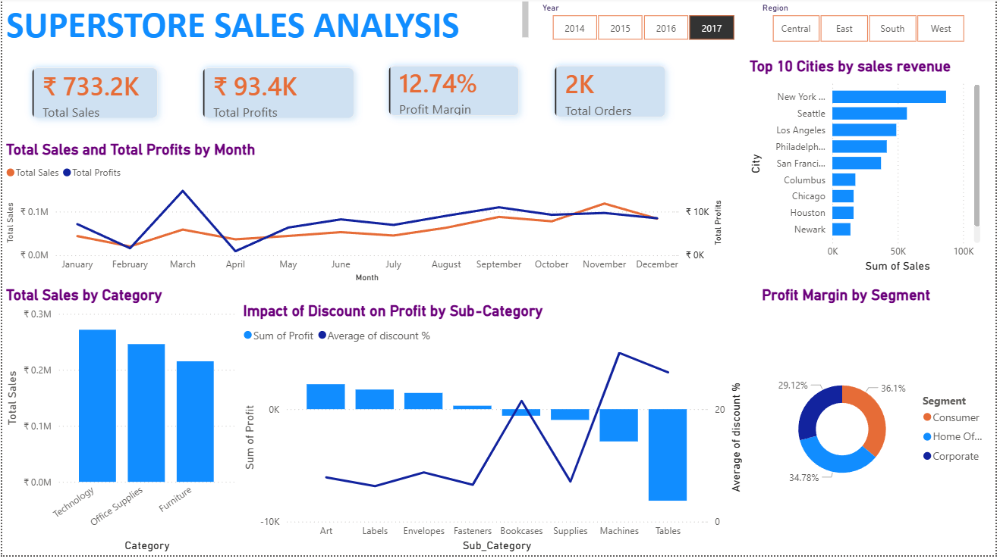

## Superstore Sales Analysis

## 📌 Project Overview

This project analyzes Superstore sales data using SQL and Power BI to identify profit leakage, understand discount impact, and recommend strategies to improve profitability.

## 🎯 Objective
- Identify loss-making products and categories
- Analyze the impact of discounts on profit
- Detect high-risk customers, cities, and segments
- Recommend data-driven pricing strategies

## 🛠️ Tools & Technologies
- SQL (MySQL) – Data cleaning, transformation, and analysis
- Power BI – Data visualization and dashboard creation

## 🗂️ Data Modeling

The dataset was normalized into multiple tables for efficient querying:

- Customers
- Products
- Orders
- Order_Details
- Location

## Key Step:
Introduced a surrogate key (ProductKey) due to inconsistencies in ProductID

## 📊 Key Insights

## 📈 Sales & Profit Trends
Sales and profit increased steadily over the years
However, profit margin declined in 2017, indicating reduced efficiency

## 💸 Profit Leakage Analysis
- Furniture → Tables sub-category is the biggest loss driver
- Losses are mainly caused by high discounting

## 🏷️ Discount Impact
- Discounts above 20–30% significantly reduce profitability
- Tables sub-category losses are driven by medium to high discounts (20%–50%)
- Orders without discounts remain profitable

## 🌍 Regional Insights
Top loss-making cities:
Chicago
Philadelphia
Knoxville
Home Office segment contributes the most to losses in these cities

## 👥 Customer Analysis
- A small number of customers receive high discounts
- Few high-value orders with heavy discounts cause major losses

## 📦 Product-Level Insights
- Several products generate high sales but negative profit
- Indicates poor pricing and discount strategy

## 📊 Profit Optimization Simulation
- Limiting discount to maximum 30%:
- Could increase profit by approximately ₹50K
- Assumes cost remains constant

## 🏆 High Performing Categories
- Technology → Copiers:
- Highest profitability
- High margin with fewer orders
- Accessories & Phones:
- Stable and consistent profit

## 📊 Dashboard Highlights (Power BI)
 
.png)

## KPI Cards:
- Total Sales
- Total Profit
- Profit Margin
- Total Orders

## Monthly Sales vs Profit Trend
## Sales by Category
## Top 10 Cities by Revenue
## Discount vs Profit Analysis
## Profit Margin by Segment

## 💡 Recommendations
- Limit discounts to ≤ 20–30%
- Reduce discounts in loss-making sub-categories (Tables)
- Monitor high-discount customers
- Focus on high-margin products like Copiers
- Implement region-specific pricing strategies

## 🚀 Conclusion

This analysis shows that discount strategy plays a critical role in profitability. By optimizing discounts and focusing on high-performing products, businesses can significantly improve margins and reduce losses.

## 👩‍💻 Author

Bhuvaneshwari.S
